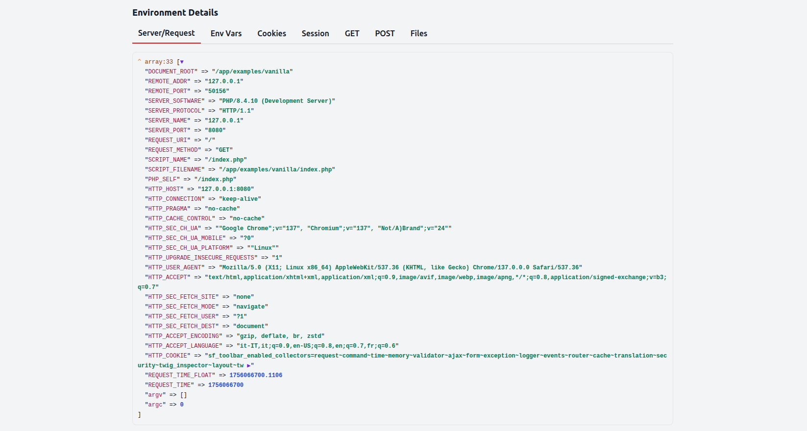

# PHP Error Insight

A tool that intercepts PHP errors, warnings, and exceptions and provides practical help and advice generated by AI (local models or external APIs). No static text: details and suggestions are created on-the-fly by artificial intelligence based on the error message and context.

Screenshots:





- Supports local AI backends (e.g. Ollama/LocalAI) and APIs (e.g. OpenAI, Anthropic, Google Gemini).
- HTML, text or JSON output.
- Simple configuration via environment variables or by instantiating the Config.

## Requirements
- PHP >= 7.4
- Composer
- (Optional) a local AI backend (Ollama/LocalAI) or an API key (OpenAI, etc.)

## Installation

```bash
composer require raffaelecarelle/php-error-insight
```

## Configuration
You can configure the tool via environment variables or through code.

Supported environment variables:
- PHP_ERROR_INSIGHT_ENABLED: true/false (default: true)
- PHP_ERROR_INSIGHT_BACKEND: none|local|api|openai|anthropic|google|gemini
- PHP_ERROR_INSIGHT_MODEL: model name (e.g. llama3:instruct, gpt-4o-mini, claude-3-5-sonnet-20240620, gemini-1.5-flash)
- PHP_ERROR_INSIGHT_API_KEY: API key (required for api/openai/anthropic/google backends)
- PHP_ERROR_INSIGHT_API_URL: service URL (optional override; e.g. http://localhost:11434 for Ollama, https://api.openai.com/v1/chat/completions for OpenAI, https://api.anthropic.com/v1/messages for Anthropic, https://generativelanguage.googleapis.com/v1/models for Google Gemini)
- PHP_ERROR_INSIGHT_LANG: language for AI prompt (it, en, ...; default: en)
- PHP_ERROR_INSIGHT_OUTPUT: auto|html|text|json (default: auto)
- PHP_ERROR_INSIGHT_VERBOSE: true/false (default: false)
- PHP_ERROR_INSIGHT_TEMPLATE: path to a custom HTML template (optional)

Configuration examples:

1) Local backend (Ollama):

```bash
export PHP_ERROR_INSIGHT_BACKEND=local export PHP_ERROR_INSIGHT_MODEL=llama3:instruct export PHP_ERROR_INSIGHT_API_URL=[http://localhost:11434](http://localhost:11434)
```

2) API backend (OpenAI compatible):

```bash
export PHP_ERROR_INSIGHT_BACKEND=api
export PHP_ERROR_INSIGHT_MODEL=gpt-4o-mini
export PHP_ERROR_INSIGHT_API_KEY=sk-...
export PHP_ERROR_INSIGHT_API_URL=https://api.openai.com/v1/chat/completions
```

3) API backend (Anthropic Claude):

```bash
export PHP_ERROR_INSIGHT_BACKEND=anthropic
export PHP_ERROR_INSIGHT_MODEL=claude-3-5-sonnet-20240620
export PHP_ERROR_INSIGHT_API_KEY=api-key
# optional override
# export PHP_ERROR_INSIGHT_API_URL=https://api.anthropic.com/v1/messages
```

4) API backend (Google Gemini):

```bash
export PHP_ERROR_INSIGHT_BACKEND=google
export PHP_ERROR_INSIGHT_MODEL=gemini-1.5-flash
export PHP_ERROR_INSIGHT_API_KEY=api-key
# optional override
# export PHP_ERROR_INSIGHT_API_URL=https://generativelanguage.googleapis.com/v1/models
```

## Usage (Vanilla PHP)
In your application's bootstrap, register the handler included in the examples, or use the helper provided by the package. A minimal example is available in examples/vanilla/index.php.

Quick example:


```php
use ErrorExplainer\Config; use ErrorExplainer\Register;
require **DIR**.'/vendor/autoload.php';
$config = Config::fromEnvAndArray([ 'backend' => 'local', // none | local | api 'model' => 'llama3:instruct', 'language'=> 'en', 'verbose' => true, ]);
Register::install($config); // sets up error and exception handlers
// Generate an error to see the output strpos();
```

Output:
- In HTML you'll see the page with stack trace and the "Details/Suggestions" section populated by AI.
- In CLI you'll get text/JSON depending on configuration.

## How it works
- The tool intercepts errors/warnings/exceptions.
- Builds a prompt with message, severity and location.
- Sends the prompt to the configured AI backend.
- Shows the AI response as details and practical suggestions.

Note: the tool no longer uses static translated texts for details/suggestions. If the AI backend is not configured or doesn't respond, those sections might remain empty.

## Privacy
Avoid sending sensitive data to the backend. You can anonymize messages and paths, or use a local backend.

## License
GPL-3.0-or-later

This project is licensed under the GNU General Public License v3.0 or later. See the LICENSE file for details.